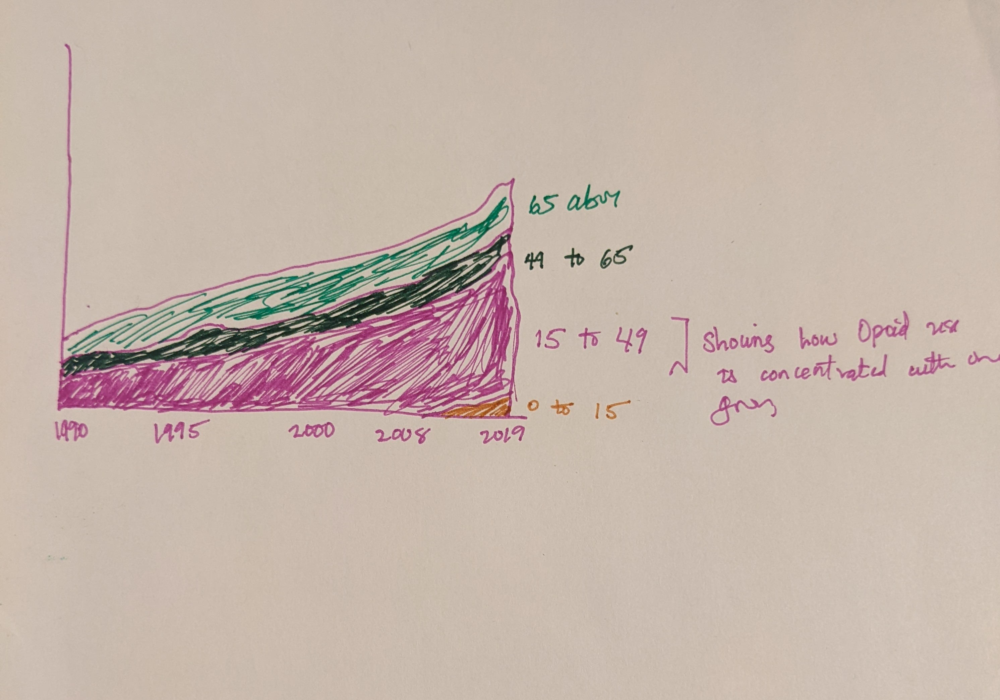
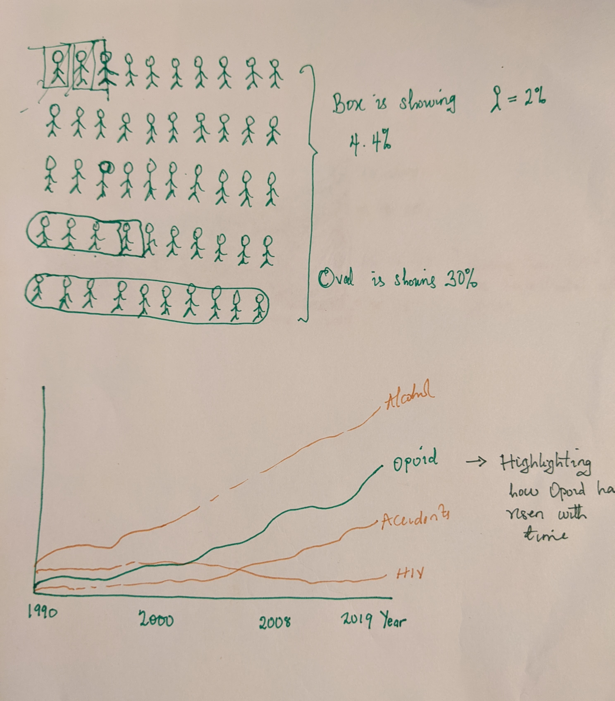

# The Opioid Crisis in America

## Outline
The purpose of this project is to talk about the opoid crisis in the United States, the rise over the years and possible reasons reasons for this rise in the use of opoids. My call to action will be "This is a big policy issue. I think we should find a solution and quick"

Throughout the project, I will explore the origins of opoids, the rise of opoid use among the populace. I got inspired to do this topic due to unchecked negatice conseqences that can occur if the spread of drug use is left unchecked.

Here’s an overview of the major elements of my story:

1). Talk about the origins of Opoid

2). Give a comparison of the United States populace in context of the world and compare it to the opoid usage over all the other countries of the world
  For example:
  > According to the International Narcotics Board, the United States has 4.4% of the world's population while consuming 30.2% of the World's opoid.

3). Talk about how the issue has changed so much and opoid use has risen from 1990 to the dangerous level of usage it is at right now. Also talk about how this usage has also risen among the most healthy age group of 14 to 49. Also along that time period

4). Next Pivot to why it became like this. Many reasons but expand mainly on push by pharmaceutical companies.

5). Talk about the ways the Pharmaceutical companies have pushed this and why it might be very had to stop.

6). Call to Action
> In this section, I will remind the audience about the consequences of opoid use and how it leads to indirect diseases such as liver damage and HBP. In other situations, it can also lead to death.

## Initial Sketches
- Comparison of 4.4% of population with 30.2 % of world's opoid usage.
- Rise in usgae from 1990 to 2019.
- Rise in usage among various age groups.
- Impact of pharmaceuticals on FDA over the years.

## The Data

The data souces I wll use are:
1). Inforation Technology and Information Foundation.  How the Prescription Drug User Fee Act Supports Life-Sciences Innovation and Speeds Cures. Click [here](https://www2.itif.org/2017-pdufa-life-sciences-innovation.pdf)
2). Food and Drung Administration at a glance. Click [here](https://www.fda.gov/about-fda/fda-basics/fact-sheet-fda-glance)
3). Our World in Data. Click [here](https://ourworldindata.org/drug-use)
4). The Conversation. Click [here](https://theconversation.com/why-is-the-fda-funded-in-part-by-the-companies-it-regulates-160444)
5). Global Burden of Disease Collaborative Network. Global Burden of Disease Study 2019 (GBD 2019) Results. Seattle, United States: Institute for Health Metrics and Evaluation (IHME), 2021. Click [here](http://ghdx.healthdata.org/gbd-results-tool)

## Method and Medium
Method

I plan to draw out my actual storyboard to have an idea of what it look like. I will also build up some visualizations using Flourish and make little tweaks to my storyflow if needed.

Medium

I plan on using Shorthand for this project. I will use Shorthand to pull together text and visualizations into a coherent story. The headers within Shorthand will correspond to each of the major elements of my Storyboard, as outlined above.

## References
1). Global Burden of Disease Collaborative Network. Global Burden of Disease Study 2019 (GBD 2019) Results. Seattle, United States: Institute for Health Metrics and Evaluation (IHME), 2021. Retrived from http://ghdx.healthdata.org/gbd-results-tool

2). Hannah Ritchie and Max Roser (2019). _Drug Use_ Our World in Data. https://ourworldindata.org/drug-use

3). C. Michael White (2021). _Why is the FDA funded in part by the companies it regulates?_ https://theconversation.com/why-is-the-fda-funded-in-part-by-the-companies-it-regulates-160444

4). Stephen J Ezell (2017). _How the Prescription Drug User Fee Act Supports Life-Sciences Innovation and Speeds Cures_. https://www2.itif.org/2017-pdufa-life-sciences-innovation.pdf

